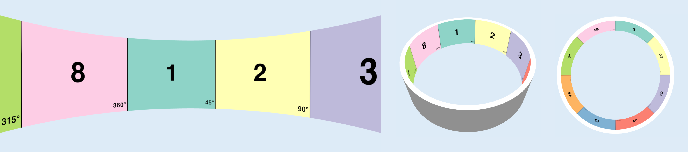
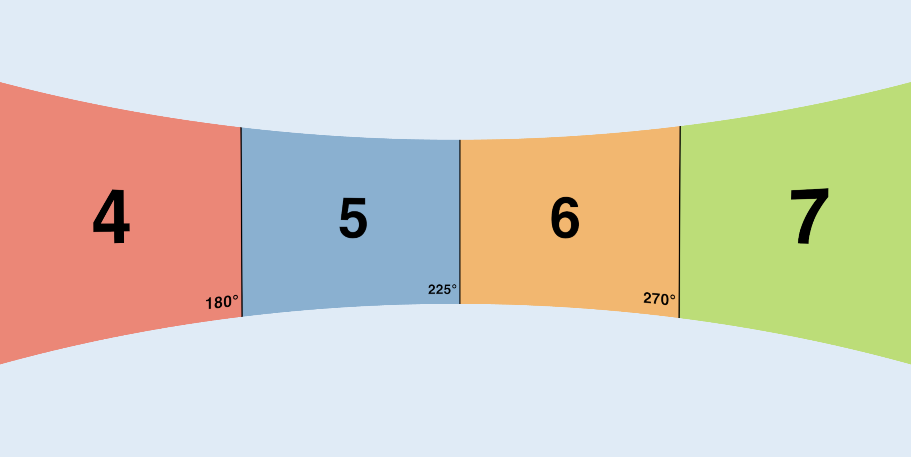
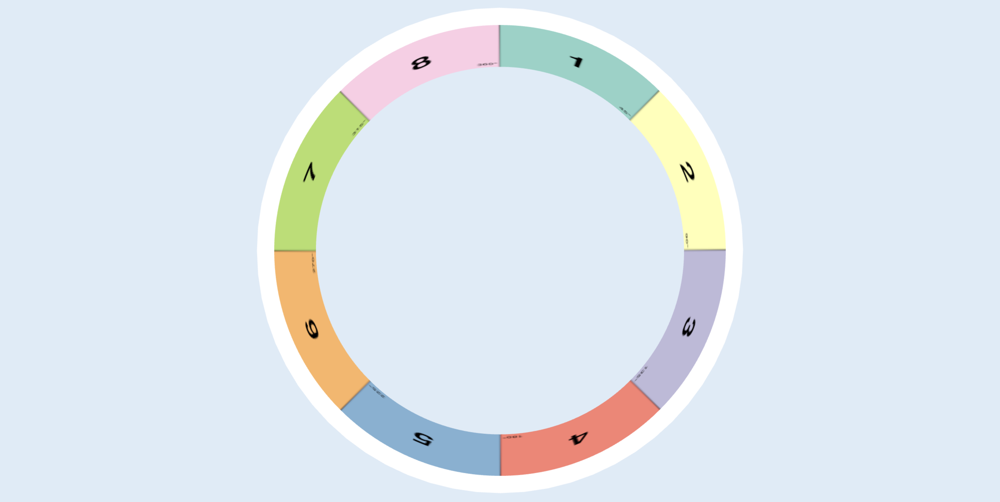
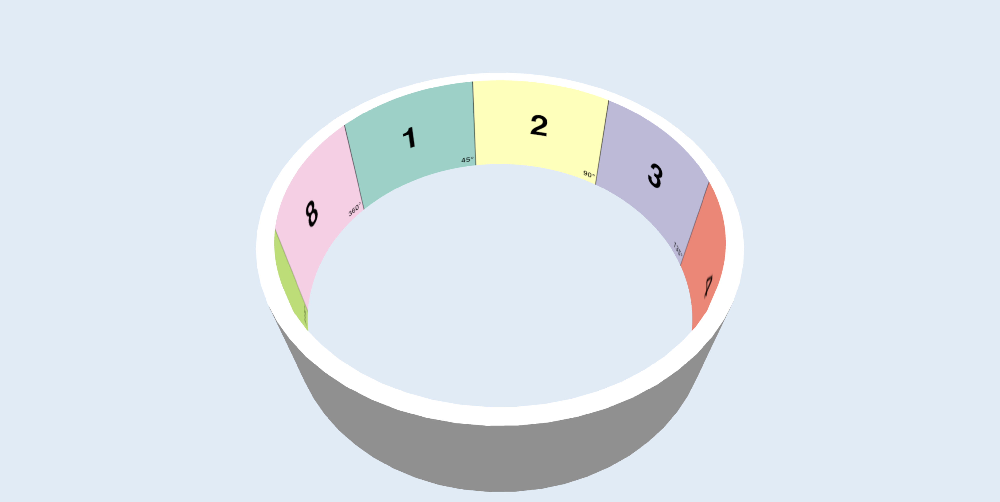
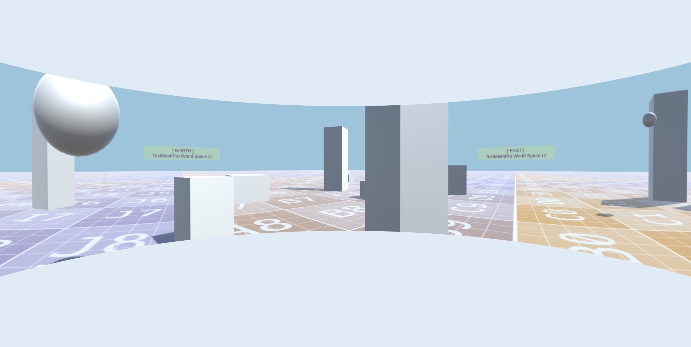
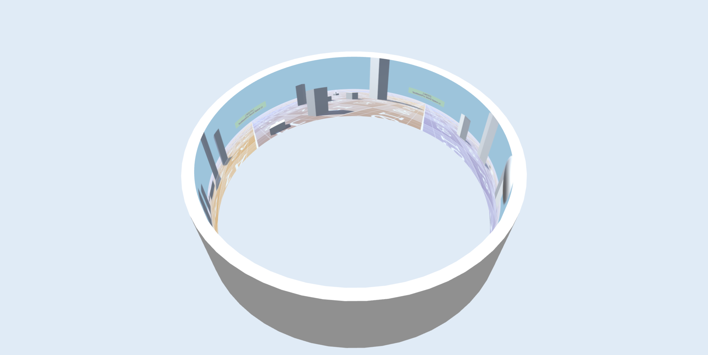
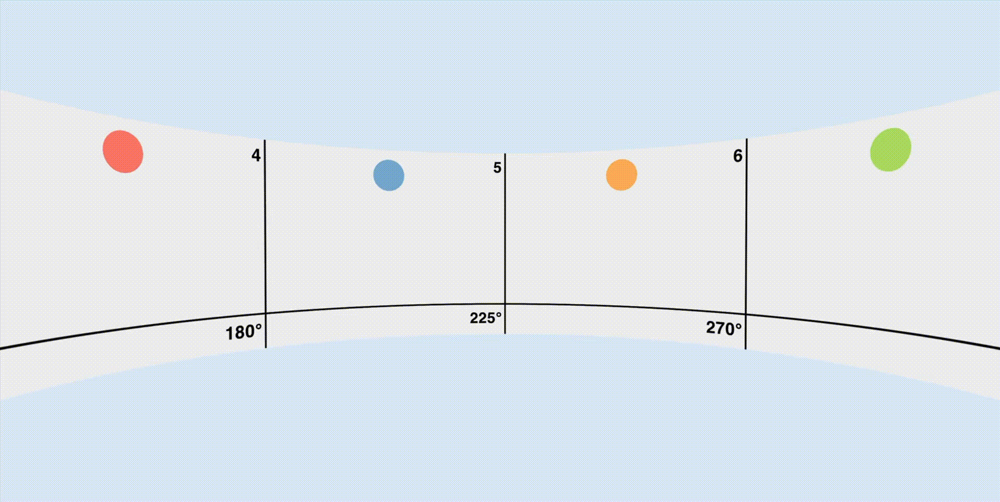
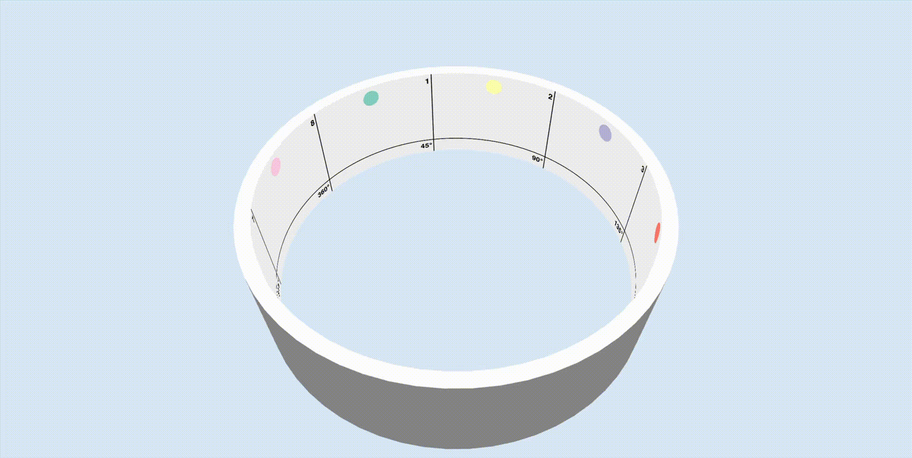
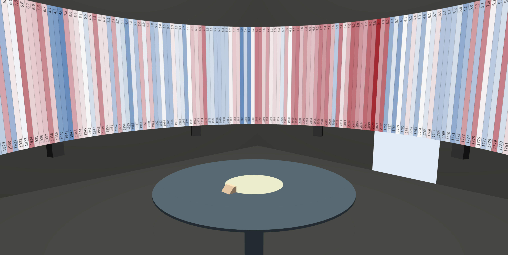

# Three.js - Cylindrical Display Preview

Lightweight web-based implementation to visually preview image and video content inside an immersive 3D cylindrical display. [[Demo](https://nicoversity.github.io/threejs-cd-preview/)]

## Table of Contents
* [Background](#Background)
* [Features](#Features)
* [Dependencies](#Dependencies)
* [Documentation](#Documentation)
* [Demo](#Demo)
* [Screenshots](#Screenshots)
* [Changelog](#Changelog)
* [License](#License)

## Background
Some of my research interests evolve around the visualization of data in immersive information spaces. One such space is the [Norrköping Decision Arena](https://liu.se/en/research/norrkoping-decision-arena) at Linköping University, Campus Norrköping, featuring a large 360-degree cylindrical display that can be utilized as a visualization platform. This project is intended to provide capabilities to preview data visualizations and information designs (in image or video format) for display in such a (or similar) cylindrical display facility without the need to be physically on site, aiming to streamline the design and testing process.

## Features
* web-based implementation that can run locally/offline or be deployed online
* responsive canvas that automatically adjusts to the window size of the web browser
* easy to configure cylindrical display model (radius, height, geometry)
* easy to add own textures (images and videos) for preview in the cylindrical display
* camera (rotate, zoom) interaction
* keyboard interaction to iterate between multiple textures for preview

## Dependencies
This project has been built using the following specifications:

* [HTML](https://developer.mozilla.org/en-US/docs/Web/HTML)
* [CSS](https://developer.mozilla.org/en-US/docs/Web/CSS)
* [JavaScript](https://developer.mozilla.org/en-US/docs/Web/JavaScript/Reference)
* [JSON](https://developer.mozilla.org/en-US/docs/Web/JavaScript/Reference/Global_Objects/JSON)
* [Three.js](https://github.com/mrdoob/three.js) r184

## Documentation
### Project File Structure
File|Description
:---|:---
`index.html`|HTML implementation
`styles.css`|CSS implementation, linked in `index.html`
`scripts.js`|Main implementation of the project based on JavaScript to create the 3D scene with the cylindrical display model using the Three.js library, linked in `index.html`
`config.js`|Configuration of the 3D scene and the cylindrical display model in JSON, imported in `scripts.js`
`data.js`|References to all texture file paths (image and video files) for preview in JSON, imported in `scripts.js`
`lib`|Directory with library files, e.g., Three.js
`public`|Directory where all texture files (image and video files) should be placed
`docs`|Files related to the documentation of this project

### How to use
#### Run the implementation locally/offline
To run the web-based application locally on your computer, the following steps are recommended:

1. Install [Visual Studio Code](https://code.visualstudio.com).
2. Install the Visual Studio Code extension [Live Server](https://marketplace.visualstudio.com/items?itemName=ritwickdey.LiveServer) *by* Ritwick Dey.
3. Clone/download this repository.
4. Open Visual Studio Code, select `Open Folder...`, and navigate to the location of the cloned/downloaded repository.
5. Select `Go Live` in the Visual Studio Code status bar (by default, located at the bottom right of the interface). Your default web browser should open automatically and display the web application, by default running at the IP address `127.0.0.1:5500`.

#### Interactive features
The application supports the following interactions:

* `mouse - left hold & move`: rotate
* `mouse - scroll forward/backward`: zoom in/out
* `keyboard - arrow right/left`: iterate to the next/previous texture (image or video) based on all entries in the `data.js` file
* `keyboard - g`: toggle display/hide of graphical user interface
* `gui - toggle video playback`: manually play/pause video via graphical user interface element
* `gui - display next texture`: iterate to the next texture (image or video) via graphical user interface element

#### Add your own textures

To add your own textures (image and video files) for preview in the cylindrical display, two steps are required:

**Step 1: Add image/video file**
* Place your prepared image or video file inside the `public` directory.
* Image file format recommendation (tested): `.png`, `.jpg`
* Video file format and encoder recommendation (tested): `.mp4`, `.mov`; encoded via `H.264` or `H.265`

**Step 2: Edit data.js**
* Open and edit the `data.js` file by adding a new JSON object to the `CylindricalDisplayData` array.
* Edit the value for the key `textureUrl` to refer to the file path and name of your added texture file (see step 1).
* Edit the value for the key `isVideo` to indicate if the added texture file is an image (`false`) or a video (`true`).

**Hints and troubleshooting**
* Please inspect the `data.js` file and follow the implemented structure. Consider to copy & paste an existing JSON object and simply edit its values. By default, the project includes two representative images and one video for display in the application. First, a test/reference image, dividing the cylindrical 360 space into eight equally sized sections. Second, a 3D scene rendered with an equirectangular projection (cylindrical equidistant projection). And third, a test/reference video (no audio), dividing the cylindrical 360 space into eight equally sized sections, each with a bouncing ball animation.
* For appropriate preview/projection, the texture files should be in a resolution and/or aspect ratio that corresponds to the cylindrical display configuration (see `CylindricalDisplayConfig` in `config.js`). To determine the aspect ratio based on `radius (r)` and `height (h)`, first calculate the cylindrical display `circumference (c = 2 * PI * r)`, and then determine the `aspect ratio (ar:1 = c / h)`.
* If the video texture remains black (your video file cannot be loaded and does not play), try to re-encode the video file using [HandBrake](https://handbrake.fr).

#### Change the configuration of the 3D scene and the cylindrical display
To adjust the default settings of the 3D scene, including the camera's position and focus point, as well as the cylindrical display model, simply open, inspect, and edit the `config.js` file. Note that the intended unit convention corresponds to `1 unit == 1 meter`.

## Demo
An interactive [demo](https://nicoversity.github.io/threejs-cd-preview/) of the web-based application featured in this repository is available online (via GitHub Pages).

## Screenshots
Cylindrical Display Preview, Example 1: Front\

Cylindrical Display Preview, Example 1: Top Down\

Cylindrical Display Preview, Example 1: Angled\

Cylindrical Display Preview, Example 2: Front\

Cylindrical Display Preview, Example 2: Angled\

Cylindrical Display Preview, Example 3: Front\

Cylindrical Display Preview, Example 3: Angled\

Cylindrical Display Preview, Extended Example: A [warming stripes](https://en.wikipedia.org/wiki/Warming_stripes) data visualization with additional 3D geometry to visually represent physical surroundings of the cylindrical display (*not included as part of this repository*)\

# Changelog
**2026.06**
* video texture support
* Three.js library upgrade (r170 to r184)
* updated example textures
* graphical user interface: video playback controls, and support to iterate to the texture (e.g., on mobile platforms when keyboard input is not available)
* minor refactoring and improvements

**2024.11**
* initial release
* image texture support

## License
MIT License, see [LICENSE.md](LICENSE.md)
